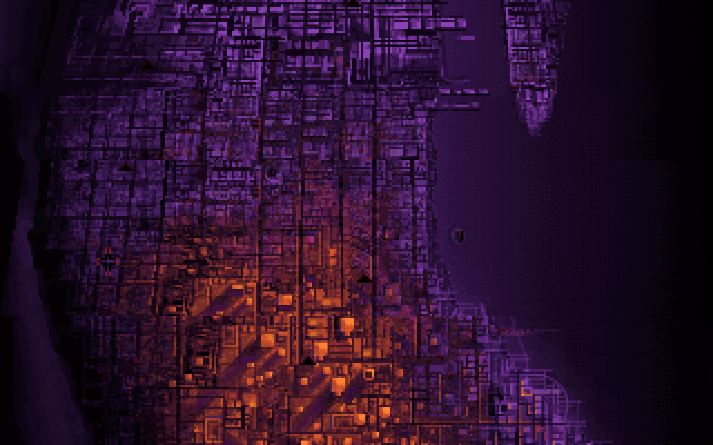
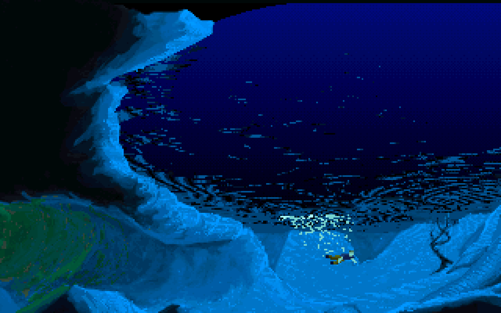
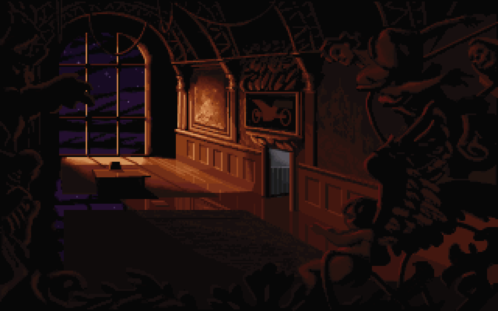
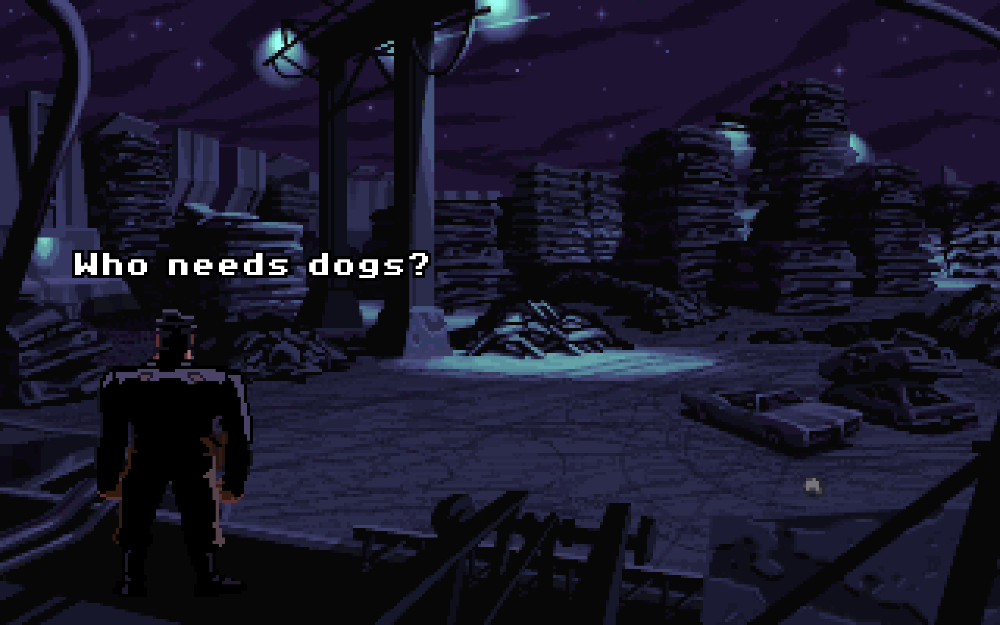
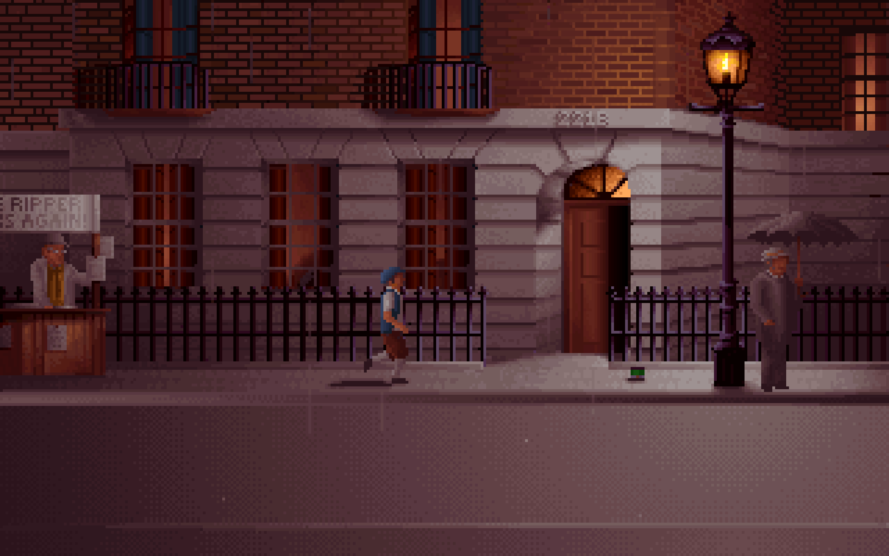

A wallpaper collection curated for atmosphere, minimal distraction and humor.

### [Download as zip](https://github.com/maciej-ka/dos-games-wallpapers/archive/master.zip)

Alone in the Dark 
Another World 
Beneath a Steel Sky 
BloodNet 
Day of the Tentacle 
Full Throttle 
Indiana Jones and the Fate of Atlantis 
Ishar 2: Messengers of Doom 
Ishar 3: The Seven Gates of Infinity 
Sam & Max Hit the Road 
Sensible Soccer 
Sid Meier's Civilization 
The Dig® 
The Lost Files of Sherlock Holmes 
The Secret of Monkey Island 
Monkey Island 2: LeChuck’s Revenge 

## Image list

