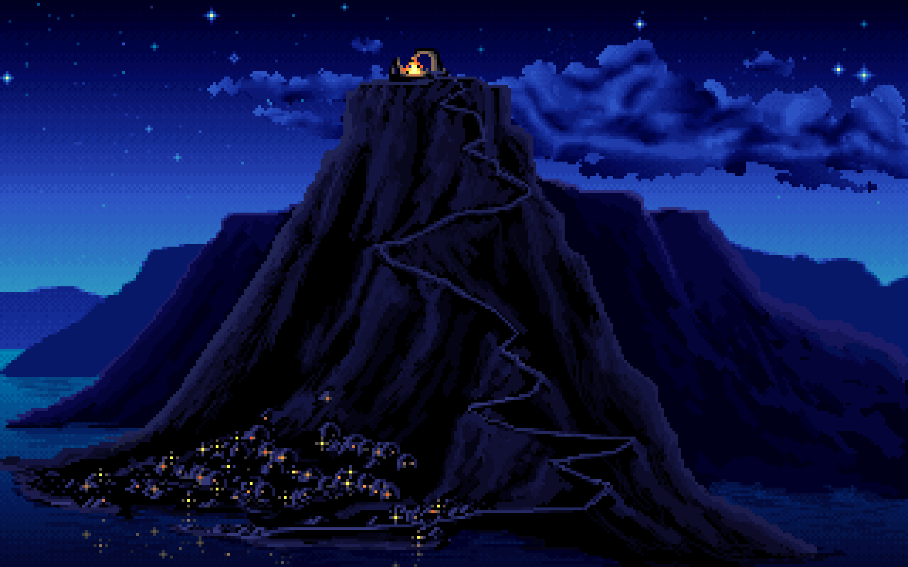
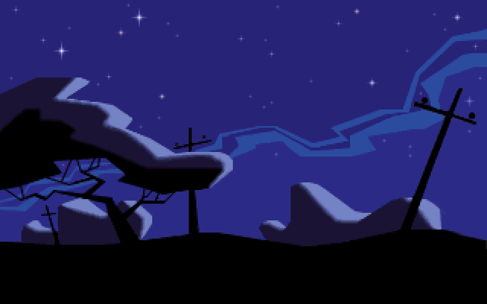

Nostalgia brew for your desktops

A wallpaper collection made from dos games screenshots.
Selected by humor, low distraction, atmosphere.

Together with iTerm looks like:

### [Download zip](https://github.com/maciej-ka/dos-games-wallpapers/archive/master.zip)
 

## Sources:
game list by prefix:

another: Another World 
bloodnet: BloodNet 
civ: Sid Meier's Civilization 
dig: The Dig® 
full: Full Throttle 
indy: Indiana Jones and the Fate of Atlantis 
ishar: Ishar 2 Messengers of Doom 
monkey: The Secret of Monkey Island 
sam: Sam & Max Hit the Road 
sherlock: The Lost Files of Sherlock Holmes 
sky: Beneath a Steel Sky 
tentacle: Day of the Tentacle 
